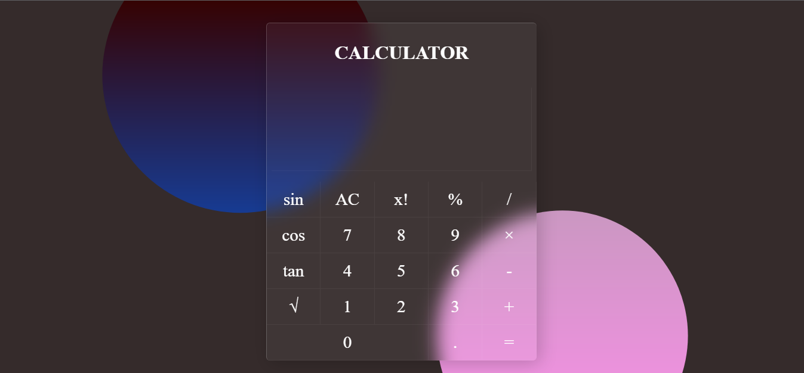

# Calculator

I made it using basics of javascript events. Basically it is a minor project from which I learnt click event of javascript.I also use glassmorphism of css and tilt.js for better UI and effects.

## Screenshot

